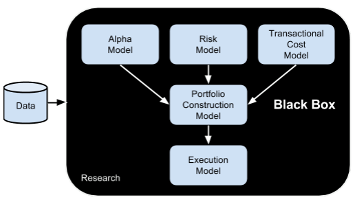

Probably the simplest ever structure of quantitative trading strategy was proposed in a book "Inside the Black Box: A Simple Guide to Quantitative and High Frequency Trading" by Rishi K. Narang:



According to this model, each strategy consists of the following components:

## Alpha model

Alpha model consists of some sort of rules or predictive factors that derive the active value of the strategy.

Simple example of an alpha:

```python
vol_delta = sign(data['{}_Volume'.format(symbol)].diff())
close_delta = data['{}_Close'.format(symbol)].diff() * - 1.0
data[symbol] = vol_delta * close_delta
```

## Risk (constraints) model

Risk model has some sort of constraints, for example, how much we will buy or sell, that'll keep the risk of the strategy under control.

Example of risk model:

```python
def risk_per_trade_asset(equity, risk=2):
    return equity * risk / 100
```

## Transaction costs model

Transaction costs rules manage everything associated with trading fees, slippages, spreads and market impact.

## Portfolio (optimization) model

Portfolio model may have rules for assets, their selection and weights we would trade.

An excerpt from an example portfolio model:

```python
EVALS = [
    ('some_metric(returns=ret)', False, 'cs')
]

for s in all_symbols:
    try:
        ret = data['{}_diff'.format(s)]
        if len(retturns) == len(benchmark):
            val = eval(EVALS[0][0])
            lst.append((s, val))
    except Exception as err:
        pass
    lst = sorted(lst, key = lambda x: x[1], reverse=algo[0][1])
    symbols_to_invest = [s[0] for s in lst[:portfolio_size]]
```

## Execution model

Execution model will manage everything associated with placing, closing, canceling trades and how they would be executed.

For example, simplest execution model for the large positions would be to buy in small increments to reduce market impact.

To create great strategies, all those models should be in place.

Although this is time consuming, but it makes, as an example, Goldman Sachs to be profitable 93.6% of the time.

It's a bit different for retail traders, but will talk about that later.
