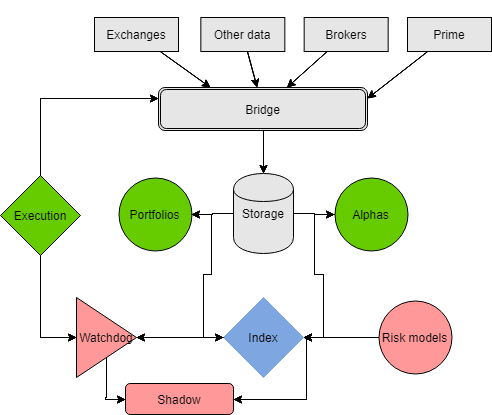

BlueBlood uses advanced quantitative approaches to trading, diversification and portfolio construction.

Equity universe is constructed primarily from developed markets and liquid, large cap stocks.

Trading process includes quantitative screening of both equities, bonds and strategies, which are diversified using several approaches into universal quantitative trading strategies index and controlled using several macroeconomic risk metrics.

In particular, trading stategies index consists of two types of diversified strategies portfolio - active (alphas) and passive (portfolios). Shadow module is virtual trading mechanism which is enabled with risk and watchdog models in times of an extreme stress to track returns and enable the real trading when drawdowns become acceptable.

Our approach to risk management consists of event driven risk controls and diversification based on volatility and other lesser known metrics.
